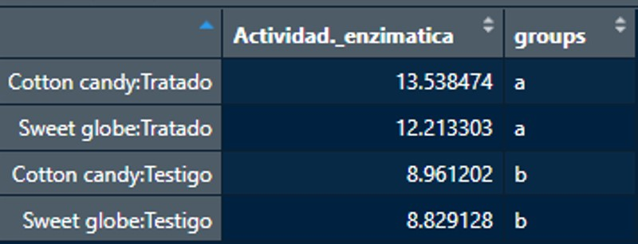

# Resultados muestras vid Perú

## _Análisis:_ Actividad Enzimática, Conteo total de hongos y Bacterias.

#### Librerias

```{r,message=FALSE}

library(dplyr)
library(tidyverse)
library(car)
library(agricolae)
library(latexpdf)
library(tinytex)
library(devtools)
devtools::install_github('yihui/tinytex')

```

#### Datos

```{r}

Resultados <- read.csv("~/capR/curso/curso_Innovak/Proyecto/Datos/Muestras_peru.csv")

Estanque_de_plantas <- read.csv("~/capR/curso/curso_Innovak/Material_clase/Estanque_plantas.csv")

```

_Verificación de datos_

```{r}

# Actividad_enzimatica

hist(Resultados$Actividad._enzimatica)
qqnorm(Resultados$Actividad._enzimatica)
shapiro.test(Resultados$Actividad._enzimatica)


# Hongos_totales

hist(Resultados$Hongos_totales)
qqnorm(Resultados$Hongos_totales)
shapiro.test(Resultados$Hongos_totales) 


# Bacterias_totales 

hist(Resultados$Bacterias_totales)
qqnorm(Resultados$Bacterias_totales)
shapiro.test(Resultados$Bacterias_totales) 
# Normalizar datos 

shapiro.test(log(Resultados$Bacterias_totales)) 
hist(log(Resultados$Bacterias_totales))
qqnorm(log(Resultados$Bacterias_totales))

# Verificar el balance de los datos

Resultados %>%
  group_by(Variedad) %>%
  summarise (n())

# Homogenidad de varianza


leveneTest(log(Bacterias_totales) ~ Variedad*Tipo_muestra, data = Resultados) # no hay homogeneidad

leveneTest(Actividad._enzimatica ~ Variedad*Tipo_muestra, data = Resultados) # si hay homogeneidad


```

### Los resultados de verificación son los siguientes:

#### __Actividad_enzimatica__:

*Shapiro*= 0.09226
Conforme a los resultados de shapiro, es >0.05, por lo cual ya estan normalizados los datos y también con las graficas se puede observar que si.

#### __Bacterias_totales__: 

*Shapiro*=0.01489
Conforme a los resultados de shapiro, es <0.05, por lo cual es necesario transformar los datos, y en la grafica se observa que tiene un sesgo a la derecha por lo que utilcé log para normalizarlos.

#### __Balance de datos__: 
Es importante verificar que se cuente con el mismo numero de datos, en este analisis se cuenta con 16 datos para la variedad *cotton candy* y 16 para *sweet globe*

#### __Homogeneidad de varianza__: 
Se realizó la prueba de Levene arrojando los siguientes resultados

1.*Bacterias_totales*: p= 0.01062
2.*Actividad_ezimatica*:p = 0.5357

##### Con los resultados anteriores se concluye que si hay homogeneidad con los datos de actividad enzimatica y que con la interacción de los datos con Bacterias_totales no hay homogeneidad.


### __ANOVA__

```{r}

# Anova dos vías

Anova_enz <- aov(Actividad._enzimatica ~ Variedad*Tipo_muestra, data = Resultados)

Anova(Anova_enz)

# Prueba Tukey

Anova_tukey <- TukeyHSD(Anova_enz)
plot(Anova_tukey)


summary(Anova_enz)

grupos <- HSD.test(Anova_enz, trt = c("Variedad","Tipo_muestra"),
                  alpha = 0.05)


```

### __Interpretación resultados__

#### Conforme a los resultados obtenidos en la prueba de Tukey se interpreta de la siguiente manera:

1. En las muestras de los tipos de variedades da un valor p = 0.145 por lo que __no__ hay diferencias significativas entre la variedad *Sweet globe* y *Cotton candy*

2. En las muestras de los tipos da un valor de p = 6.63e-09, por lo que aquí __si__ hay diferencias significativas en las muestras *testigo* y *tratadas*

3. En la interacción de las muestras de variedad con el tipo ya sea testigo o tratado __no__ hay diferencia significativa ya que el valor de p = 0.230 

#### Separar por grupos

#### También se corrió el análisis donde separa por grupos, se puede observar en la siguiente tabla:





#### El grupo __A__ correponde a los tratados en los cuales no hay diferencia significativa, y el grupo __B__ corresponde a los testigos, por lo que se concluye lo mismo que se menciona anteriormente que __si__ existe una diferencia entre el grupo A y B __Testigos y Tratados__, pero en la variedad no hay diferencia.

#### Las muestras testigo pertenecen a muestras de suelo sin aplicación de producto biológico y las muestras tratadas fueron aplicadas con el producto y si hay un aumento de la actividad enzimatica aplicando el tratamiento por lo cual está relacionado al incremento de microorgnismos en suelo.

#### Para conocer más sobre que es un análisis de varianza tipo ANOVA, a informacion la pueden encontrar en el siguiente link:


[Mas información](https://rpubs.com/Joaquin_AR/219148)


### Se utilizó el codigo de shapiro para transformar el valor de los datos

```{r}

# Cambiar el valor de los resultados de Actividad enzimatica de ug a mg

for (i in 1: nrow(Resultados)) {
  enz_mg <- Resultados$Actividad._enzimatica[i]/1000
  print(enz_mg)
}


```

## Ejercicio

### Determinar si existe una correlación entre la biomasa de dos especies acuáticas de plantas en estanques de Alaska: Carex y Artophila, usando datos modernos.

```{r}

# Seleccionar columnas que vamos a utilizar para el analisis 

Tmodificada <- Estanque_de_plantas[,c("Era", "Artophila", "Carex")]

Modificada <- Tmodificada %>%
  filter(!is.na(Artophila),!is.na(Carex)) %>%
  select(Era, Artophila, Carex)
   

# Verificar si cumple con las funciones 

plot(Modificada$Artophila,Modificada$Carex)


## Correlacion 

cor.test(Modificada$Artophila,Modificada$Carex)


```

#### Resultados

#### El coeficiente de correlación da un valor de 0.6625044 y el p-value =0.001996, por lo que se considera que la correlación es significativa ya que para considerar eso es necesario que el valor de p-value sea <0.05


